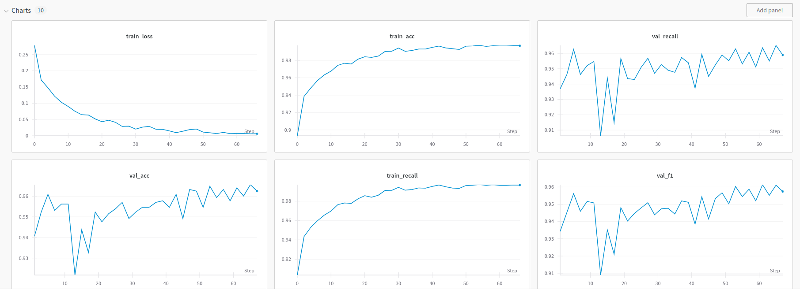
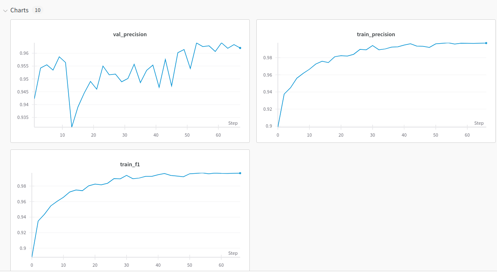
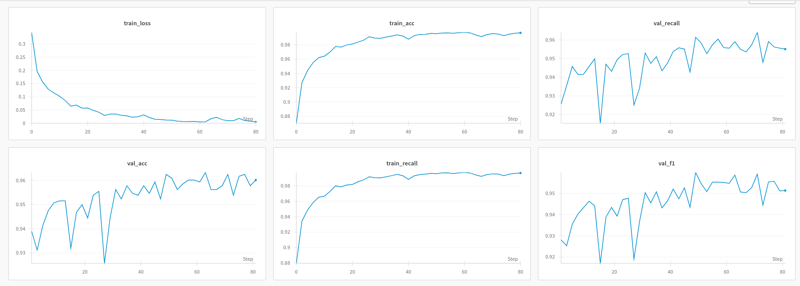
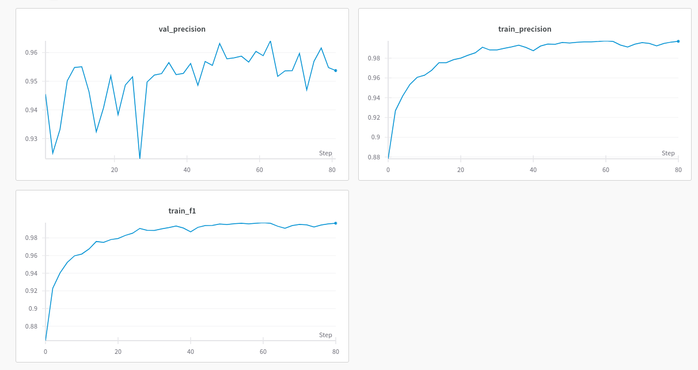
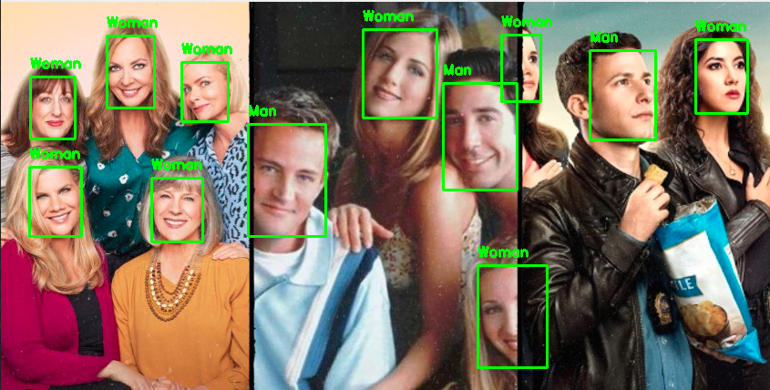
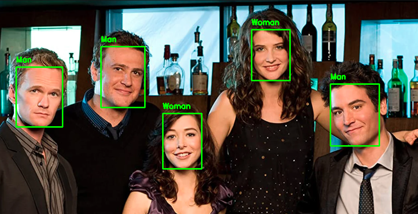
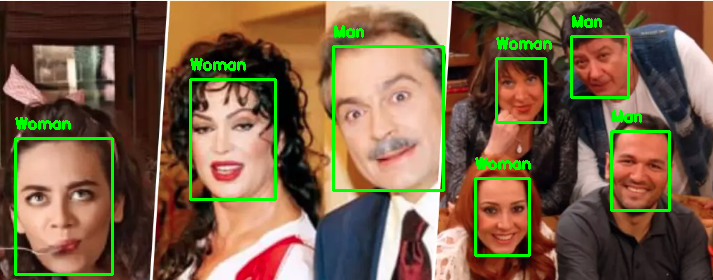

# Gender Prediction

This project aims to predict gender from human face photographs using a dataset available on Kaggle. It employs deep learning models and image processing techniques.

For face detection, RetinaFace has been employed, while for gender classification, ResNet18 has been utilized.

## Dataset

The dataset used in this project can be found on Kaggle under the name [Gender Recognition Dataset](https://www.kaggle.com/datasets/rashikrahmanpritom/gender-recognition-dataset/data). It includes various face photographs along with their corresponding gender labels.

## Installation ans Using

To run this project locally, follow these steps:

## 1. Clone the repository and Download models:
```bash
git clone https://github.com/<kullanıcı_adı>/<repo_adı>.git
```
- [Gender Models Link](https://drive.google.com/drive/folders/1XanusRqS4VD_Jv5-ob7xegieg8LVNMdy?usp=sharing)

## 2. Navigate to the project directory:

```bash
cd your_repository_name
```

## 3. Create a virtual environment and Install the required libraries:
```bash
python -m venv venv
source venv/bin/activate  
pip install -r requirements.txt
```

## 4. Inference
```bash
$ python inference.py --input test_img/1037.png --gender_model models/gender_ResNet18_2.pth  --device cuda:0 
```

## 5. Gradio
```bash
python app.py --device cuda:0
```

## 6. Train graphics

- WandB has been used for monitoring and visualizing training graphs.

### 1- "models/gender_ResNet18_3.pth"





### 2- "models/gender_ResNet18_2.pth"






## Results

Below are some examples of the project in action:







 


## License

This project is licensed under the [MIT License](LICENSE).


